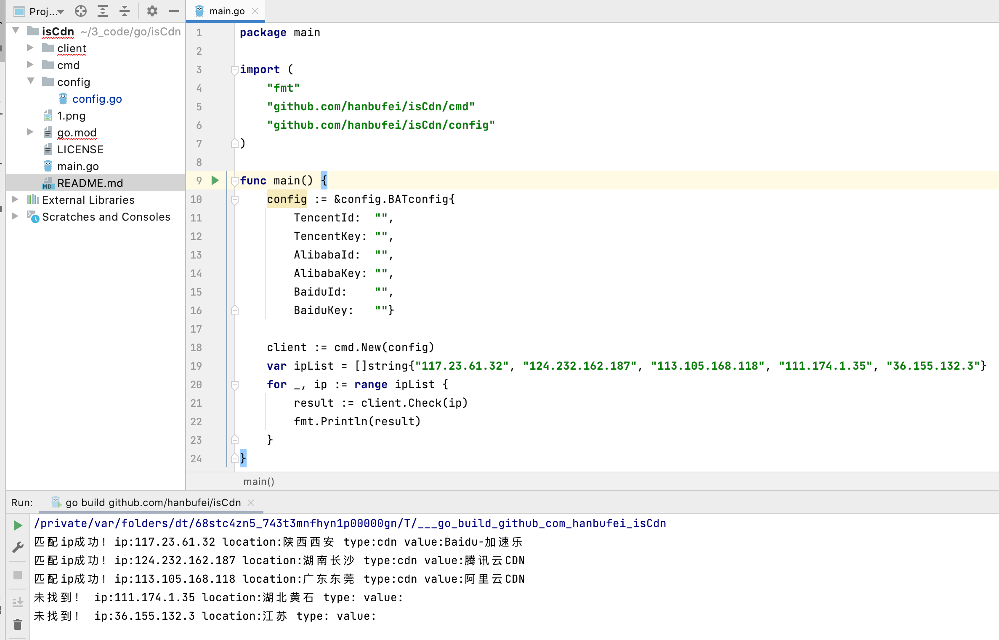

# 检查一个ip是否在cdn范围内
目前已经完成的cdn检测范围：
* cloudfront：内置字典
* fastly：内置字典
* google：内置字典
* leaseweb：内置字典
* stackpath：内置字典
* 知道创宇：内置字典
* 百度智能云CDN：内置字典
* 腾讯云CDN：内置字典
* 阿里云CDN：内置字典
* 网宿CDN：内置字典
* Baidu-加速乐：内置字典
* 腾讯cdn：官方api -> DescribeCdnIp
* 阿里cdn：官方api -> DescribeIpInfo
* 百度cdn：官方api -> describeIp

## 内嵌数据源

数据在clinet/data目录下，其中sources_data是国外的数据，sources_china是国内数据。
格式为：
`{"cdn":{"knownsec": []},"waf":{},"cloud":{} }`

## 使用方式：api调用

1. 导入github.com/hanbufei/isCdn/cmd
2. 定义BATconfig，输入腾讯阿里百度3家云的key。如果不想调用BAT的官方api接口进行检测，相关值设为空即可。
3. new和check即可。参考代码如下：
```bigquery
package main

import (
	"fmt"
	"github.com/hanbufei/isCdn/cmd"
	"github.com/hanbufei/isCdn/config"
)

func main() {
	config := &config.BATconfig{
		TencentId:  "",
		TencentKey: "",
		AlibabaId:  "",
		AlibabaKey: "",
		BaiduId:    "",
		BaiduKey:   ""}

	client := cmd.New(config)
	var ipList = []string{"117.23.61.32", "124.232.162.187", "113.105.168.118", "111.174.1.35", "36.155.132.3"}
	for _, ip := range ipList {
		result := client.Check(ip)
		fmt.Println(result)
	}
}
```

## 感谢

mabangde